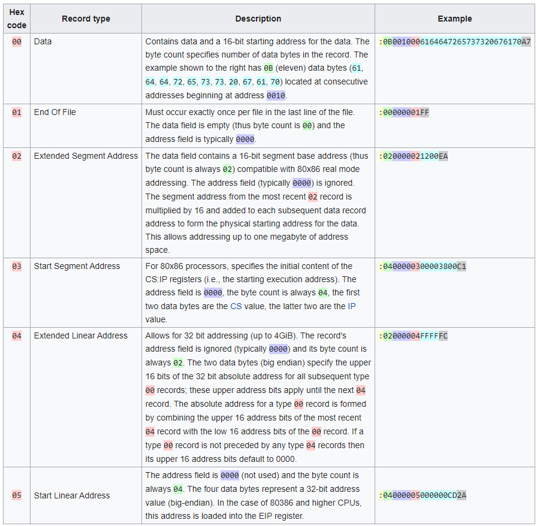

# SMoS - Structured Messaging over Serial
 *Photo by Moritz Erken*

SMoS is a client/server REST based messaging protocol, originally intended as a mechanism to encapsulate data and it's context when transmitted over a serial link.

#### Where does the message starts and where does it ends?

Every message has a beginning and an end. Currently all we know is that bytes of data is being sent from one end to the other, bit by bit across the serial link. We needed some kind protocol to make sense of these data. After some browsing around I came across the following protocols:
* [Motorola S-record Hex Format](https://en.wikipedia.org/wiki/SREC_(file_format))
* [Intel Hex Format](https://en.wikipedia.org/wiki/Intel_HEX)
* [Tektronix Hex Format](https://en.wikipedia.org/wiki/Tektronix_hex_format)

Of the three, I found the Intel Hex Format's structure to be most suited to our need while not being too overly complicated.

##### Intel Hex Format

Intel Hex is a binary-to-text encoding format, i.e. it allows binary data to be encoded in a printable (ASCII) format. It has six standard record types:

For us we don't intend to send files or program across the serial link therefore we are only interested in the Data record type. We also don't intend to persist the data so the *address* field will be unused for now (i.e. address field = 0x0000). If you are curious on how the data record is structured, a more detailed explanation can be found [here](https://web.archive.org/web/20200301224049/https://www.sbprojects.net/knowledge/fileformats/intelhex.php), we will go through some real world scenarios in my next post.

#### What is the message?

Given we now have the capability to decode the 0s and 1s into a message, our next task is to make sense of the message's content. It could be a string, a number, a toggle state. But how do we know? We need the sender to tag the content for the receiver the make sense of it.

Luckily there are a few well known standard protocols out there that we can model. [Bluetooth BLE](https://www.bluetooth.com) is one such protocol and is very well documented. We will lean somewhat on their Bluetooth [GATT Specifications](https://www.bluetooth.com/specifications/gatt/) for the services and data definition so that we don't need to reinvent the wheel. Based on GATT Specifications, every piece of data is associated with a 16-bit assigned number. We will be using the same assigned number to tag the data going across the serial link. However, there will also be option to send generic data in which case the receiver is assumed to know the context in advance. We will go through some real world scenarios in my next post.

#### What should we do with the message?

Data is meaningless by itself. For the receiver to correctly process the data we need to know the context the data is in. This will be done by tagging the messages with actions (e.g. CRUD operations against databases, GET, POST, PUT, DELETE methods on REST servers). In our case we will model the Constrained Application Protocol (CoAP) as needed to provide the required data context. You can learn more about CoAP [here](https://coap.technology/). We will go through some real world scenarios in my next post.

#### So what does SMoS look like?

Now that we have discussed the questions we wanted to ask, we can start putting the pieces together and see in theory what Structured Messaging over Serial looks like.

* ->[SMoS Defined](smos_defined.md)
* ->[SMoS Example](smos_example.md)