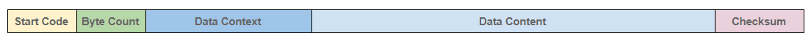
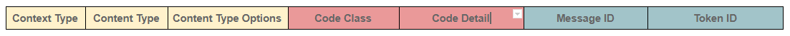
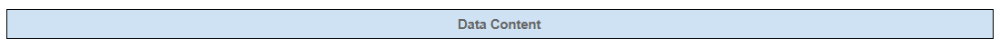

# SMoS - Structured Messaging over Serial
 *Photo by Moritz Erken*

SMoS is a client/server REST based messaging protocol, originally intended as a mechanism to encapsulate data and it's context when transmitted over a serial link. A more detailed background is described in [Part 6 of An IoT Odyssey](https://dev.to/chrisdinhnz/smos-structured-messaging-over-serial-part-1-14hf)

##### The SMoS Structure

The structure of a SMoS message can be broken down as follow:

###### Start Code
  * Every message begins with a colon (ASCII Hex value $3A)

###### Byte Count
  * A 2 digit value (1 byte), counting the actual data bytes in the message.

###### Data Context
  * A 6 digit (3 byte) value, containing various meta data about the message content.

###### Data Content
  * There can be 0 to 255 data bytes per message.

###### Checksum
  * This field is a one byte (2 hex digits) 2's complement checksum of the entire record.

##### The Data Context

Unlike the Intel Hex data record, the address and record type fields are not used. Instead these three bytes will be redefined as follow:

###### Context Type
* Two MSB bits of the first byte.
* The values is defined as follow:
  + Confirmable (0x0)
  + Non Confirmable (0x1)
  + Acknowledgement (0x2)
  + Non Acknowledgement (0x3)

###### Content Type
* Two bits following Context Type.
* The values is defined as follow:
  + Generic content (0x0)
  + Bluetooth GATT content (0x1)
  + Reserved (0x2)
  + Reserved (0x3)

###### Content Type Options
* Four LSB bits of the first byte.
* It's values are determined by the Content Type.

###### Code Class
* Three MSB bits of the second byte.
* The values is defined as follow:
  + Request (0x0)
  + Success response (0x2)
  + Failed response, sender error (0x4)
  + Failed response, recipient error (0x5)

###### Code Detail
* Five LSB bits of the second byte.
* If code class is 0x0 and code detail is 0x0, it is an empty message.
* If code class is 0x0 and code detail is not 0x0, then the values is defined as follow:
  + GET, OBSERVE (0x1)
  + POST (0x2)
  + PUT (0x3)
  + DELETE (0x4)
* If code class is 0x2, then the values is defined as follow:
  + CREATED (0x1)
  + DELETED (0x2)
  + VALID (0x3)
  + CHANGED (0x4)
  + CONTENT (0x5)
* If code class is 0x4, then the values is defined as follow:
  + BAD REQUEST (0x0)
  + UNAUTHORIZED (0x1)
  + BAD OPTION (0x2)
  + FORBIDDEN (0x3)
  + NOT FOUND (0x4)
  + METHOD NOT ALLOWED (0x5)
  + NOT ACCEPTABLE (0x6)
  + PRECONDITION FAILED (0x12)
  + REQUEST ENTITY TOO LARGE (0x13)
  + UNSUPPORTED CONTENT FORMAT (0x15)
* If code class is 0x5, then the values is defined as follow:
  + INTERNAL SERVER ERROR (0x0)
  + NOT IMPLEMENTED (0x1)
  + BAD GATEWAY (0x2)
  + SERVICE UNAVAILABLE (0x3)
  + GATEWAY TIMEOUT (0x4)
  + PROXYING NOT SUPPORTED (0x5)

###### Message Id
* Four MSB bits of the third byte.
* Used to match messages of type Acknowledgement/Reset to messages of type Confirmable/Non-confirmable, and guard against message duplication.

###### Token Id
* Four LSB bits of the third byte.
* Used to correlate notifications with OBSERVE requests.

##### The Data Content

The actual user/application data with varying length.

