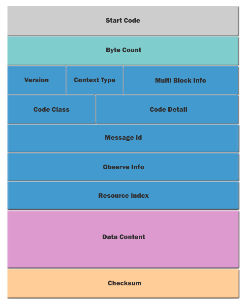

# SMoS Defined

* <- [Back](README.md)

#### The SMoS Packet Structure

###### Start Code
  * Every message begins with a colon (ASCII Hex value $3A)
  * Byte index = 0
  * 1 byte

###### Byte Count
  * Count of payload bytes in the message
  * Byte index = 1
  * 1 byte

###### Version
  * Protocol version
  * Currently always set to 1
  * Byte index = 2
  * Two MSB bits

###### Context Type
  * The values is defined as follow:
    + Confirmable (0x0)
    + Non Confirmable (0x1)
    + Acknowledgement (0x2)
    + Reset (0x3)
  * Byte index = 2
  * Two bits after Version bits

###### Multi Block Info
  * Indicating if message is last block of multi block message 
  * Byte index = 2
  * Four LSB bits
  * First (MSB) bit of this field indicates last block flag
  * Remaining 3 bits indicating block sequence index
  * If last block flag is set and remaining bits are 0, indicates single block message

###### Code Class
  * The values is defined as follow:
    + Request (0x0)
    + Success response (0x2)
    + Failed response, sender error (0x4)
    + Failed response, recipient error (0x5)
  * Byte index = 3
  * Three MSB bits

###### Code Detail
  * If code class is 0x0 and code detail is 0x0, it is an empty message.
  * If code class is 0x0 and code detail is not 0x0, then the values is defined as follow:
    + GET (0x1)
    + POST (0x2)
    + PUT (0x3)
    + DELETE (0x4)
  * If code class is 0x2, then the values is defined as follow:
    + CREATED (0x1)
    + DELETED (0x2)
    + VALID (0x3)
    + CHANGED (0x4)
    + CONTENT (0x5)
  * If code class is 0x4, then the values is defined as follow:
    + BAD REQUEST (0x0)
    + UNAUTHORIZED (0x1)
    + BAD OPTION (0x2)
    + FORBIDDEN (0x3)
    + NOT FOUND (0x4)
    + METHOD NOT ALLOWED (0x5)
    + NOT ACCEPTABLE (0x6)
    + PRECONDITION FAILED (0x12)
    + REQUEST ENTITY TOO LARGE (0x13)
    + UNSUPPORTED CONTENT FORMAT (0x15)
  * If code class is 0x5, then the values is defined as follow:
    + INTERNAL SERVER ERROR (0x0)
    + NOT IMPLEMENTED (0x1)
    + BAD GATEWAY (0x2)
    + SERVICE UNAVAILABLE (0x3)
    + GATEWAY TIMEOUT (0x4)
    + PROXYING NOT SUPPORTED (0x5)
  * Byte index = 3
  * Five LSB bits

###### Message Id
  * Used to match messages of type Acknowledgement/Reset to messages of type Confirmable/Non-confirmable, and guard against message duplication.
  * Byte index = 4
  * 1 byte

###### Observe Info
  * Indicates observe request (when code detail is GET)
  * Indicates observe notification update (when code detail is CONTENT)
  * Byte index = 5
  * First (MSB) bit of this field is set if message is observe request or observe notification updates
  * Remaining bits indicating observe notification index

###### Resource Index
  * Associates with a resource hosted by the server
  * Server can host up to 256 resources
  * Byte index = 6
  * 1 byte

###### Data Content
  * actual payload of message
  * Payload can be 0 to 255 bytes per message

###### Checksum
  * Used to check integrity of message
  * This field is the 2's complement of the entire message excluding the start code
  * Last byte of message
  * 1 byte
